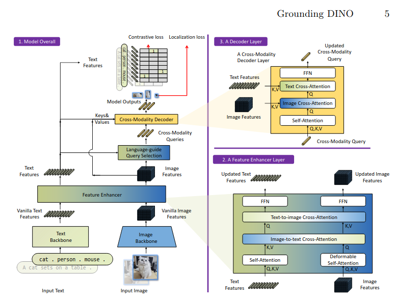
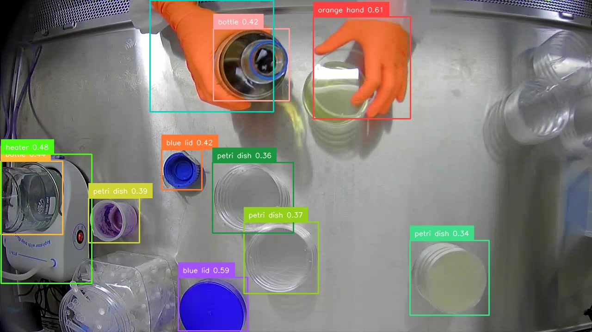
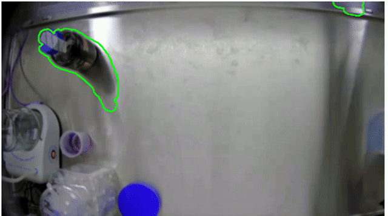
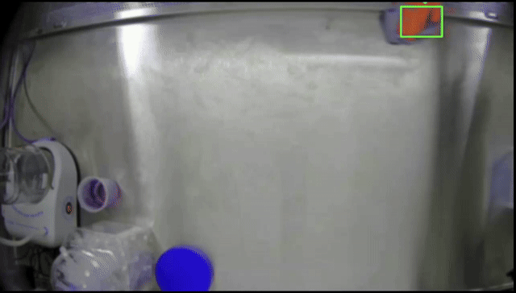

## Introduction

The aim of the task is to, given a video sample, develop a solution that is able to: 
* Identify different object types in the scene (petri dishes, bottles, hands).
* Determine interactions between objects (e.g., hand touches dish, dish is filled).
* Track the count of filled dishes as the scene unfolds.
* Identify any additional vision-based insights in the scene that you find compelling.

We focus on the first 2 items and then discuss future work to develop an improved and full solution for the problem.

We approached the problem following the tracking-by-detection paradigm, where objects are detected frame by frame (independently) and then detections are associated across frames.
The first problem is "how to detect the target classes?". We considered two ways: 1) Traditional CV and 2) Learning based (AI/ML). 

For 1), one could find and segment "blobs", identify or classify them based on colour, appearance, geometry, etc. even extract and match hand-crafted sparse features (sift, etc). In fact, one approach that we considered and briefly tested was zero-shot classification of such blobs via [CLIP](https://github.com/openai/CLIP) (but it did not quite work for the target ontology).

For 2), one could train(or fine-tune) an object detector model for the classes of interest; there are popular ones like [yolo](https://github.com/Deci-AI/super-gradients/blob/master/YOLONAS.md), [DETR](https://github.com/lyuwenyu/RT-DETR) (and follow-ups), [fasterrcnn](https://docs.pytorch.org/tutorials/intermediate/torchvision_tutorial.html), etc. The latter approach would be preferable as learning-based methods have shown good performance to traditional CV challenges, e.g., lack of texture, colour/intensity changes, occlusions, view-point changes, etc.

Note, however, that learning-based approaches, even for few-shot learning, would require a suitable labelled dataset for the target domain. Whereas We could extract and label frames from the labelled video for a PoC demo, this is not my preferred approach; as it would be like cheating -- training and testing on the same data --.

Based on the limited data and limited time, we explored zero-shot open-set detection via [Grounding DINO](https://github.com/IDEA-Research/GroundingDINO). Here, we light tuning to allow the model to detect the target classes, and then implement a simple object tracker to associate frame-to-frame detections. Additionally, after initial inspection of the video sequence, we show how motion/saliency priors can help to mitigate false positive or incorrect detections. We implement a basic multi object tracker (`CentroidTracker`) as a quick way to associate detections across frames. 

In addition to lack of time/data, the motivation for the combination of off-the-shelf (detector) + from-scratch (tracker) implementation stems from code availability/suitability. Whereas plenty of implementation for detectors and trackers exist, they often are lacking license or had one not suitable for commercial purposes. In some other cases, documentation is not clear, or I did try them but did not work.


## Methods

### Detection
As introduced above, we focus on zero-shot detection with Grounding DINO. Grounding DINO extends a closed-set object detection model with a text encoder, enabling open-set object detection. 

In addition to the input image, the pre-trained model exposes 3 important parameters:
1. Input text (i.e., prompt): List of candidate labels to be detected on each image.
2. Box threshold: Score threshold to keep object detection predictions based on confidence score.
3. Text threshold: Score threshold to keep text detection predictions,

We use these parameters to tune the zero-shot detection performance of the model. The image below shows the model prediction with the following text input: `orange hand.petri dish.bottle.blue lid.heater.`


To remove some bad or irrelevant predictions, we add a constraint such that detections are only valid if they are in salient/foreground regions. We use a simple background subtraction algorithm to find such salient or relevant regions in the sequence. The clip below shows an example of such saliency/foreground masks.


### Tracking
We perform object detection for each frame and iteratively update tracked objects via a "simple" centroid tracker (`CentroidTracker`). The object tracker uses the bounding box and class information to associate detections over time. A simple `ObjectTrack` class allows to store key information for each object. The main parameters for tracking are: 1) The max number of frames after which an object is considered lost, 2) The distance (pixels) to consider an object as the same from one frame to the other and, 3) A smoothing factor to update object locations. During experiments, we noted a jittery behaviour in the detector; therefore a Non Maximum Suppression (NMS) step is performed internally in the tracker. Future work includes propagating scores or confidences from the detector to the tracker. 

The clip below shows a short example of object tracking for the video sample

## Results
Previous section showed intermediate results for detection and tracking. The full video with detections/tracks can be found [here](https://drive.google.com/file/d/1wwo_jimO8o9Trq_WyIroI4PW6XUm6LVp/view?usp=drive_link)

## Future work and limitations

### Detector
There are many limitations to the current approach. Many of them related to somewhat overfitting the parameters to the sample sequence.
For instance, detecting the hands has been encoded as "orange hand" to improve the zero-shot performance of the detector. Earlier experiments with "hand" did not work as well depending on the hand trajectory, pose or location in the frame.

Another interesting limitation is the "prompting" or tuning of the model parameters. Here, we resorted to a relaxation (i.e., lowering threshold) as to allow more detections. The trade-off is false positives (e.g., object misclassification) and false negatives (e.g., object not detected). One solution for the former was the incorporation of a richer text input and the implementation of NMS.

Some classes in the target ontology might be further away (conceptually) from the _standard_ classes used originally to train VLM or object detection models; thus, making it challenging to perform zero-shot inference. More data/time would allow to perhaps produce a dataset and train/fine-tune a more reliable detector or the VLM used here (e.g.[Open GroundingDINO](https://github.com/longzw1997/Open-GroundingDino)). We could even consider an action detection/recognition model, particularly for reliable object/hand interactions.

### Tracker

One limitation of the current tracker is the pure geometrical nature (centroid). Future work could include a more complex matching/association step, perhaps using appearance/geometrical features. Additionally, there is no "prediction" step, which would allow to project the object position into a future frame and enhance data association.

A more complex matching/association algorithm would involved re-identification so that we can, for instance, track objects even of they go out of view.

If more data becomes available, we could consider dropping this tracker all together and train a model to do the tracking. Potentially starting from a somewhat popular algorithm like DeepSORT, BytTrack, SAM2, etc. A method that is able to propagate/associate detections through video. Even something "simple" (but requiring also tuning) like [OpenCV tracking methods](https://docs.opencv.org/4.6.0/dc/d6b/group__tracking__legacy.html).


### Object interactions and state changes

To a good extend we can rely on the tracker to account for object interactions or state changes (filled/empty,etc.). One idea would be to add some specific Object class to e.g., container-like objects which can transition through states, and that have additional properties like volumes, level, material, etc.

We could do "simple" appearance based comparisons to detect, e.g., an empty vs filled container, but a representation that is able to track state changes/transitions (empty->grabbed->pouring->filled) would work best.

Similarly, hand-object interactions could be detected purely based on proximity and time. But, as mentioned above, perhaps an action recognition model would solve the problem more reliably.

Additional future work involves extracting the data in a sensible way, e.g., total object counts, interactions, etc,


## Setup & Run
Due to lack of time, we resort to a development environment, i.e., big docker image with pytorch, etc. ~14GB
1. Build docker
    ```
    bash build.sh
    ```
2. Place the video in the root of this repo so that it can be copied/processes in the container

3. Run docker (uses [NVIDIA Container Toolkit](https://docs.nvidia.com/datacenter/cloud-native/container-toolkit/latest/install-guide.html))
    Note: We mount/share the `/tmp` in the container. The resulting images/video will be store there in `/tmp/test`
    ```
    docker run -it --rm --runtime=nvidia --gpus all -v /tmp:/tmp gdino_detector bash
    ``` 
4. Run the script to start processing
    Processing the full sequence will take a while, but you can inspect some images as the script goes.
    Also note that I developed with an rtx 3080, you need ~2.5 GB of GPU memory to run inference with this version of GroundingDINO

    ```
    bash run.sh
    ```
## REFERENCES
Grounding DINO: [Paper](https://arxiv.org/abs/2303.05499), [code](https://github.com/IDEA-Research/GroundingDINO)

Grounded SAM2: [code](https://github.com/IDEA-Research/Grounded-SAM-2)
